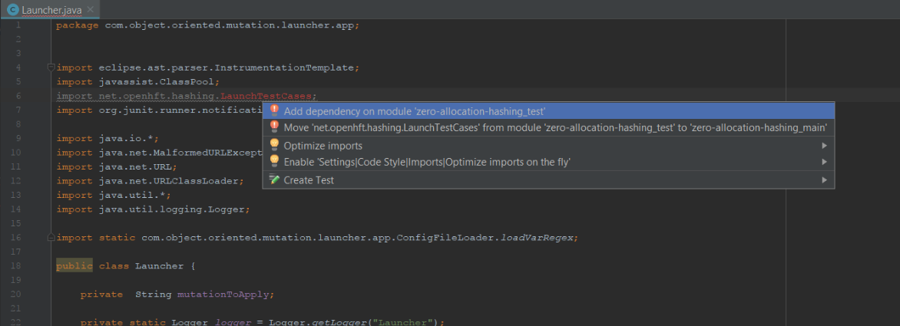

# Mutation Testing using Javassist #

## Steps for setting up the project ##

- Open the project in Intellij
- If you get the following error

- Rightclick on the project and open module settings
- Apply the following settings as shown below;

- Now rename test package shown below to `net.openhft.hashing`

- Hover over the error in Launcher.java and add the dependency as highlighted below;

- Once you do that a prompt that's shown below will be displayed 

- Click OK to add the dependency

## Steps for Gradle Build ##

- Right click on the build.gradle file and select "Run build"

## Steps for SBT Build ##

- Open terminal, from the project root directory (zero-allocation-hashing) run the following commands

    `sbt clean`
    
    `sbt run`
    
## Running the application ##

- Run the Class com.object.oriented.mutation.launcher.app.MutantPooling.java

## Mutations applied in the project ##

- Access modifier change: (AccessModifierMutant.java)
This mutant reads the class level fields on the specified class and changes the access modifiers of all the fields to public static

- Method Rename: (MethodMutant.java)
This mutant reads all the declared methods in a specified class and renames them

- Hidden variable deletion: (InheritanceMutant.java)
This mutant reads all the hidden fields from the subclasses of a specified class and then deletes those hidden fields from the subclass

- Overridden Method modification: (MethodInvocationMutant.java)
This mutant finds all the overridden methods in the subclasses of a super class and modifies the overridden method's body 
with just a call to the super class method

- Arithmetic/Conditional/Assignment Operation modification: (TransformByteCode.java)
This mutant scans the bytecode for the specified class and using the opCodes for bytecode instructions 
it performs the below mentioned mutations;

    - Arithmetic Operation Mutation: a+b mutates to a-b etc.
    - Conditional Operation Mutation: a<b mutates to a>b etc.
    - Assignment Operation Mutation: a+=b mutates to a-=b etc.

## Structure of the project ##

The high level structure of the project implementation is as below;

